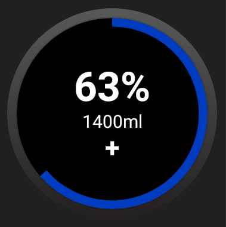
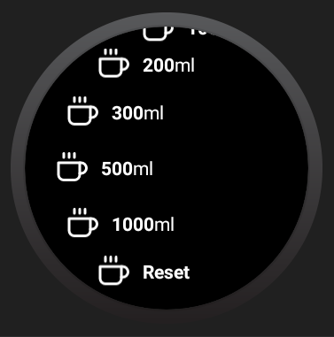
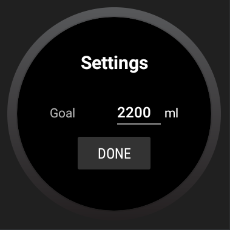

# Watermill

A WearOS app which keeps track of your water intake.

## Installation

It is not planned to publish this project to the Google Play Store. Therefore, you will need to
clone this repository to your local machine and build it there.

## Screenshots

_Main menu_

_Add water_

_Settings_

## License

Watermill is licensed under the MIT license.

This project also uses [feathericons](https://github.com/feathericons/feather).